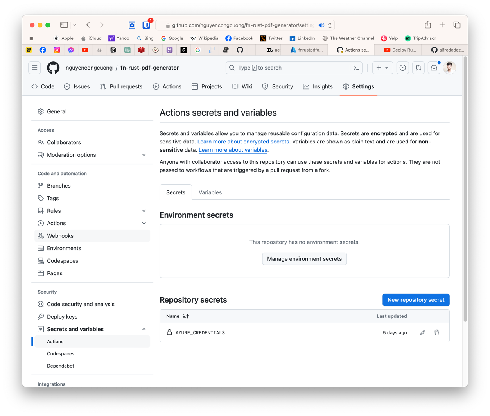

### Overview

A fast & reliable Rust based PDF generation tool which supports multiple font families.

### Commands

Local Development Mode:

Azure Function:

- Start: `func start`
- URL: http://localhost:7071

Rust:

- Start: `cargo run --release` or `cargo watch -x run`
- URl: http://localhost:3000
- Install `cargo watch` here: https://crates.io/crates/cargo-watch

### Project Initialization

To create this Rust application integrating with Azure Function.
Please do the following steps with your terminal:

- Create new function: `func new fn-rust-pdf-generator`.
- Language: `Custom Handler`
- Template: `HttpTrigger`
- Function Name: `pdf`
- Authorization Level: `Anonymous`
- Sample host.json

```json
{
  "version": "2.0",
  "logging": {
    "applicationInsights": {
      "samplingSettings": {
        "isEnabled": true,
        "excludedTypes": "Request"
      }
    }
  },
  "extensionBundle": {
    "id": "Microsoft.Azure.Functions.ExtensionBundle",
    "version": "[4.*, 5.0.0)"
  },
  "customHandler": {
    "description": {
      "defaultExecutablePath": "handler",
      "workingDirectory": "",
      "arguments": []
    },
    "enableForwardingHttpRequest": true
  }
}
```

- Sample local.settings.json

```json
{
  "IsEncrypted": false,
  "Values": {
    "AzureWebJobsStorage": "",
    "FUNCTIONS_WORKER_RUNTIME": "custom"
  }
}
```

`cd fn-rust-pdf-generator`

`cargo init --name handler`

Now you can set up a simple RESTFUL API with Rust. Such as using actix-web. Be sure the API can run successfully in
local.

### Deployment: Using GitHub Actions

After we ensure that the function can work well locally, now we will deploy it to Azure.

- Step 1: Create an Azure Function running on Linux on Azure Portal
    - Function App Name: **fn-rust-pdf-generator**
    - Deploy Code or Container: **Code**
    - Runtime Stack: **Custom Handler**
    - Version: **Custom**
    - Region: **Southeast Asia**
    - Operating System: **Linux**
    - Hosting / Plain: **Consumption**
    - Resource Group: **fnrustpdfgenerator**
- Step 2:
- Step 3: Push the local project to GitHub.
- Step 4: Create .github/workflows/main.yml as follows:

```yaml
# This is a basic workflow to help you get started with Actions

name: Deploy Azure Function
on:
workflow_dispatch:

env:
AZURE_FUNCTIONAPP_NAME: fn-rust-pdf-generator # set this to your application's name, it has to be unique
AZURE_GROUP_NAME: fnrustpdfgenerator
AZURE_FUNCTIONAPP_PACKAGE_PATH: '.'   # set this to the path to your web app project, defaults to the repository root

jobs:
build:
runs-on: ubuntu-latest
steps:
  - name: 'Checkout GitHub action'
    uses: actions/checkout@v2
  - name: Install with RustUp
    shell: bash
    run: curl https://sh.rustup.rs -sSf | sh -s -- -y

  - name: Install musl
    run: sudo apt-get install -y --no-install-recommends musl-tools

  - name: Add Linux MUSL Target
    shell: bash
    run: rustup target add x86_64-unknown-linux-musl

  - name: Build release
    shell: bash
    run: cargo build --release --target=x86_64-unknown-linux-musl

  - name: Copy handler to parent directory
    shell: bash
    run: cp target/x86_64-unknown-linux-musl/release/handler .

  # See https://github.com/Azure/azure-functions-core-tools#linux
  - name: Setup the repository
    shell: bash
    run: |
      curl https://packages.microsoft.com/keys/microsoft.asc | gpg --dearmor > microsoft.gpg
      sudo mv microsoft.gpg /etc/apt/trusted.gpg.d/microsoft.gpg
      sudo sh -c 'echo "deb [arch=amd64] https://packages.microsoft.com/repos/microsoft-ubuntu-$(lsb_release -cs)-prod $(lsb_release -cs) main" > /etc/apt/sources.list.d/dotnetdev.list'

  - name: Install Azure Core Tools
    shell: bash
    run: |
      sudo apt-get update
      sudo apt-get install azure-functions-core-tools-4

  - name: Azure Login
    uses: azure/login@v1
    with:
      creds: ${{ secrets.AZURE_CREDENTIALS }}

  - name: Deploy to Azure Functions
    shell: bash
    run: func azure functionapp publish ${{ env.AZURE_FUNCTIONAPP_NAME }} --custom
```

Please notice that in `.github/workflows/main.yml`, there is a secret called `AZURE_CREDENTIALS`. This secret enables
the GitHub Action to authenticate and deploy correctly to your function app on Azure.

To get the secret, run the command with your Azure Cloud Shell or Azure CLI in your local terminal:

```
az ad sp create-for-rbac --name "<AZURE_FUNCTIONAPP_NAME>" --sdk-auth --role contributor --scopes /subscriptions/<SUBSCRIPTION_ID>/resourceGroups/<RESOURCE_GROUP_NAME>
```

The result output should look like this:

```json
{
  "clientId": "<TEXT>",
  "clientSecret": "<TEXT>",
  "subscriptionId": "<TEXT>",
  "tenantId": "<TEXT>",
  "activeDirectoryEndpointUrl": "<TEXT>",
  "resourceManagerEndpointUrl": "<TEXT>",
  "activeDirectoryGraphResourceId": "<TEXT>",
  "sqlManagementEndpointUrl": "<TEXT>",
  "galleryEndpointUrl": "<TEXT>",
  "managementEndpointUrl": "<TEXT>"
}
```

Copy this whole credentials into your project's secrets `AZURE_CREDENTIALS`:


Push your code changes and see deployment action triggered. Your deployment should be successfully.

### Reference:

https://learn.microsoft.com/en-us/azure/azure-functions/create-first-function-vs-code-other?tabs=rust%2Cmacos
